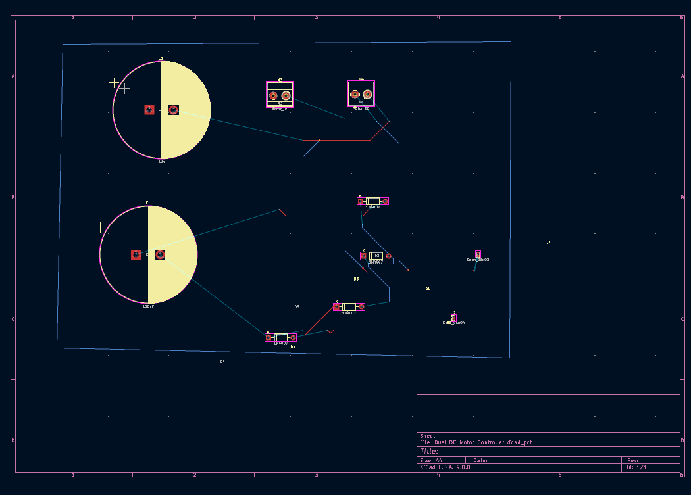

# 🚗 Dual DC Motor Controller (L298N-based)

This project is a simple and efficient **dual DC motor driver module** based on the **L298N** IC. It's designed to drive two DC motors with full H-bridge control and includes protection diodes and input/output connectors. Ideal for robotics kits, embedded systems, and motor control learners.

---

## 📦 Features

- ✅ Based on L298N dual H-bridge motor driver IC  
- ✅ Supports 2 DC motors with direction control  
- ✅ Optional PWM speed control via ENA/ENB  
- ✅ Flyback diodes (1N4007) for protection  
- ✅ Terminal blocks for motors and power  
- ✅ Logic level input via header pins  
- ✅ 2-layer compact PCB layout

---

## 🧠 Skills Demonstrated

- High-current trace routing  
- Silkscreen clarity for connectors  
- Power and thermal management  
- Modular and testable design

---

## ⚙️ Schematic Overview

- Motor driver: **L298N**
- Input voltage: **12V** regulated to **5V** using **7805**
- Control pins: **IN1–IN4**, **ENA**, **ENB**
- Output pins: **OUT1–OUT4** to motors
- Protection: **1N4007 diodes** for back-EMF across motor terminals

---

## 🔌 Pin Configuration

| Pin        | Function         |
|------------|------------------|
| IN1–IN4    | Direction control|
| ENA / ENB  | Enable/PWM input |
| OUT1–OUT4  | Motor outputs    |
| VS         | Motor power (12V)|
| VSS        | Logic power (5V) |
| GND        | Ground           |

---

## 📁 File Structure
``` Dual DC Motor Controller/
├── Dual DC Motor Controller.kicad_sch # Schematic file
├── Dual DC Motor Controller.kicad_pcb # PCB layout file
├── Dual DC Motor Controller.kicad_pro # KiCad project file
├── Dual DC Motor Controller.kicad_prl # KiCad netlist-related
├── Dual DC Motor Controller.kicad_sch-bak # Schematic backup
├── fp-info-cache # KiCad footprint cache
├── gerber/ # Gerber manufacturing files
├── Images/
│ ├── DUAL DC MOTOR 3D VIEW.png # 3D rendered board view
│ ├── DUAL DC MOTOR CONTROLLER_CKT.png # Schematic image
│ └── DUAL DC MOTOR CONTROLLER_PCB ROUTING.png # PCB routing image
└── README.md ```

---

## ⚙️ Features

- ✅ Dual motor control using **L298N**
- ✅ **Direction + Speed control** via logic pins and PWM (ENA/ENB)
- ✅ **Flyback protection diodes** (1N4007) for back EMF
- ✅ **12V motor supply**, regulated **5V logic supply** via L7805
- ✅ Screw terminal blocks for easy motor/power wiring
- ✅ Labelled headers for microcontroller interfacing

---

## 🔌 Pin Mapping

| Pin Name | Description              |
|----------|--------------------------|
| IN1–IN4  | Motor direction control  |
| ENA, ENB | Motor speed (PWM optional) |
| OUT1–OUT4 | Motor output to M1/M2   |
| VS       | Motor power input (12V)  |
| VSS      | Logic voltage (5V from 7805) |
| GND      | Common ground            |

---

## 🛠 Skills Demonstrated

- High-current trace routing
- Proper diode protection for inductive loads
- Clean schematic and silkscreen design
- 2-layer board optimization for thermal and space

---

## 🖼 Preview

### 🔧 Circuit Schematic  


### 🧩 PCB Routing  


### 🧱 3D View  


---


## 📄 License

This project is licensed under the [MIT License](LICENSE).

---

